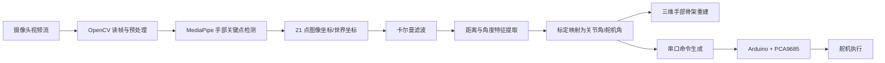

# 上位机软件：技术实现方案

## 1. 本板块在答辩中的定位

这一板块建议回答三个问题：

1. 上位机软件到底解决了什么问题。
2. 摄像头视频流是如何一步一步变成舵机控制角度的。
3. 这一过程背后使用了哪些模型、公式和技术栈。

结合本项目实际实现，上位机软件并不是单纯的界面程序，而是一个把视觉感知、标定映射、三维重建、串口通信和执行控制串起来的中枢系统。

可以先用一句话概括：

> 上位机软件以 Python 为核心，集成 MediaPipe 手部关键点检测、标定映射、三维骨架重建和串口控制，实现了“视频输入 - 姿态估计 - 关节参数求解 - 舵机命令输出”的完整闭环。

---

## 2. 软件总体架构

建议在 PPT 中先放一个总架构图，把上位机分成四层：

1. 输入层：摄像头视频流、手动滑条输入。
2. 感知层：MediaPipe 手部关键点检测、关键点滤波。
3. 计算层：距离/角度特征提取、标定映射、骨架重建。
4. 执行层：串口协议下发、Arduino 解析、PCA9685 驱动舵机。

可以直接写成：



---

## 3. 信息传递与处理流程

这一部分是答辩中的核心，建议按“输入 - 检测 - 计算 - 输出”四步讲。

### 3.1 视频流采集

- 上位机通过 OpenCV 调用摄像头，周期性读取视频帧。
- 读取到的 BGR 图像会转换为 RGB，用于后续送入 MediaPipe。
- 界面刷新和视频刷新由 Tkinter 定时调度完成，保证实时显示。

答辩表述建议：

> 首先，上位机以固定刷新周期从摄像头获取视频帧，并将图像从 OpenCV 使用的 BGR 格式转换为 MediaPipe 所需的 RGB 格式，作为后续手部关键点检测的输入。

### 3.2 手部关键点检测

- 系统优先使用 MediaPipe 的 solutions API。
- 若当前环境不支持，则回退到 MediaPipe Tasks API 的 HandLandmarker。
- 只检测 1 只手，输出 21 个手部关键点。
- 同时得到两类数据：
  - 图像坐标 landmarks：用于在视频画面中绘制骨架。
  - 世界坐标 world landmarks：用于做距离和角度计算。

这里建议强调一点：

> 本项目既利用二维关键点做可视化叠加，也利用三维世界坐标做后续的姿态计算，因此既有“看得见”的视频反馈，也有“可计算”的空间几何信息。

### 3.3 关键点滤波与稳定化

- 由于视频关键点检测天然存在抖动，因此本项目对 21 个关键点的每个坐标轴都建立了 1 维卡尔曼滤波器。
- 同样的滤波思想也应用到了距离量、关节角和追踪状态上。
- 这样做的目的不是改变姿态结果，而是降低噪声、减少舵机抖动。

答辩表述建议：

> 关键点检测的原始输出会受到光照、遮挡和模型波动影响，因此系统在进入控制计算前，先对关键点坐标进行卡尔曼滤波，使空间轨迹更加平滑，避免下游角度解算和舵机控制出现抖动。

### 3.4 从关键点到角度/控制量

这一部分要分成两条线来讲，因为项目里实际有两种“姿态求解”思路：

#### 路线 A：主程序中的控制链路

主程序 servocontrol.py 中，追踪模式的核心不是直接把每根手指的弯曲角作为舵机角，而是先计算“拇指与其他手指的相对距离”，再通过标定映射到关节目标角。

具体流程如下：

1. 提取拇指指尖与食指/中指/无名指指尖的距离。
2. 同时引入拇指 IP 关节到对应指尖的距离，做 0.5:0.5 加权，提升稳定性。
3. 用“最远距离 far”和“最近距离 near”做归一化，得到夹持程度系数 $\alpha$。
4. 再根据每根手指的标定范围，把 $\alpha$ 映射为对应的关节目标角。
5. 最终将关节目标角映射为 0 到 100 的统一控制 degree，再转换成舵机角度并发送。

这一链路的逻辑非常适合答辩，因为它体现了“视觉观测量并不直接等于控制量，而是经过标定归一化后进入控制空间”。

#### 路线 B：实验/可视化程序中的角度逆解链路

handtracking.py 中还实现了一条更偏几何建模的路线：

1. 根据世界坐标构造手掌坐标系。
2. 通过向量夹角计算手指弯曲角。
3. 通过带符号平面角计算 MCP 侧摆角。
4. 再将这些角度用于三维手指骨架重建。

更严谨的说法是：

> 这一模块本质上属于“从视觉观测反推出关节参数”的逆解过程，然后再通过正向骨架重建得到三维手部模型。答辩中如果写“逆运动学求解”，建议补充说明它更准确地属于“关节参数逆解 + 骨架正向重建”。

### 3.5 从角度到舵机命令

- 上位机内部统一使用 degree 作为控制输入，范围是 0 到 100。
- 这个 degree 会同时映射到：
  - 舵机角度 servo angle
  - 关节物理角度 joint angle
- 上位机根据标定文件生成串口命令：

```text
S,<channel>,<angle>
```

- Arduino 解析命令后，将角度转成 PCA9685 的 PWM 脉宽输出，驱动舵机执行。

答辩时可以这样总结：

> 因此，视频流最终不是直接变成 PWM 信号，而是先变成关键点，再变成距离/角度特征，再经过标定映射变成统一控制量，最后才转为舵机角度和串口命令下发到底层执行器。

---

## 4. 关键模型与算法信息

### 4.1 MediaPipe 手部模型

本项目使用的是 MediaPipe Hand Landmarker / Hands 模型。

其主要特点可以概括为：

- 输入：单帧 RGB 图像。
- 输出：单手 21 个关键点。
- 结果同时包含图像坐标与世界坐标。
- 配置中限制最多检测 1 只手，降低计算负担。
- 检测阈值和跟踪阈值设置为 0.6，兼顾准确率与实时性。

答辩建议写法：

> 手部姿态感知部分采用 MediaPipe 提供的手部关键点模型。该模型能够从单帧 RGB 图像中实时检测 21 个手部关键点，并输出二维图像坐标及三维世界坐标，为后续的距离估计、角度求解和骨架重建提供输入。

### 4.2 卡尔曼滤波模型

项目中使用一维卡尔曼滤波器对以下量进行平滑：

- 手部关键点坐标
- 手指距离量
- 关节角
- 追踪输出状态

使用理由：

- 降低检测噪声
- 提高角度曲线连续性
- 避免串口高频抖动输出

### 4.3 手部骨架几何模型

手部三维模型并不是直接使用 MediaPipe 的原始网格，而是项目自行定义的参数化骨架模型。每根手指由以下参数描述：

- root：手指根部坐标
- base_direction：初始方向向量
- segment_lengths：三段骨节长度
- channels：对应的舵机通道映射

这样设计的优点是：

- 可以把“视觉检测”与“机械模型”解耦
- 可以针对仿生手结构自由调整长度和安装方向
- 能保证界面展示的模型与硬件机构保持一致

---

## 5. 关键公式整理

这一页建议不要把公式堆得太满，保留 4 到 6 个最关键公式即可。下面这些公式与项目实现是一一对应的。

### 5.1 向量夹角公式

用于计算手指弯曲角：

$$
\theta = \arccos \left( \frac{\mathbf{v}_1 \cdot \mathbf{v}_2}{\|\mathbf{v}_1\|\,\|\mathbf{v}_2\|} \right)
$$

说明：

- 取关节两侧的骨段向量 $\mathbf{v}_1$ 与 $\mathbf{v}_2$。
- 通过夹角估计当前关节弯曲程度。

如果要换成“屈曲角”定义，可进一步写成：

$$
\theta_{flex} = 180^\circ - \theta
$$

### 5.2 手掌法向量构造公式

用于建立手掌局部坐标系：

$$
\mathbf{n}_{palm} = (\mathbf{p}_{index\_mcp} - \mathbf{p}_{wrist}) \times (\mathbf{p}_{pinky\_mcp} - \mathbf{p}_{wrist})
$$

说明：

- 该向量描述手掌平面的法向方向。
- 结合中指 MCP 指向可构造手掌前向参考轴。

### 5.3 平面带符号角计算

用于计算手指侧摆角：

1. 先把参考向量和目标向量投影到手掌平面上。
2. 再计算两者夹角，并利用叉积方向判断正负号。

可写成：

$$
\theta_{lat} = \operatorname{sign}\big(\mathbf{n} \cdot (\mathbf{v}_{ref} \times \mathbf{v})\big)
\cdot
\arccos\left(\frac{\mathbf{v}_{ref}^{\prime} \cdot \mathbf{v}^{\prime}}{\|\mathbf{v}_{ref}^{\prime}\|\,\|\mathbf{v}^{\prime}\|}\right)
$$

其中 $\mathbf{v}_{ref}^{\prime}$ 和 $\mathbf{v}^{\prime}$ 表示投影到手掌平面后的向量。

### 5.4 距离归一化公式

主控制链路中，用拇指与其他手指的距离求取夹持程度：

$$
\alpha = \operatorname{clip}\left(\frac{d_{far} - d}{d_{far} - d_{near}}, 0, 1\right)
$$

说明：

- $d$ 为当前测得的手指距离
- $d_{far}$ 为张开状态标定距离
- $d_{near}$ 为捏合状态标定距离
- $\alpha$ 越接近 1，表示当前越接近闭合/捏合状态

### 5.5 关节角与舵机角线性映射

本项目使用统一控制量 degree，范围是 0 到 100。

舵机空间映射：

$$
servo\_angle = servo\_{min} + \frac{degree}{100}(servo\_{max} - servo\_{min})
$$

关节空间映射：

$$
joint\_angle = joint\_{min} + \frac{degree}{100}(joint\_{max} - joint\_{min})
$$

这两个公式是项目的关键设计，因为它把“执行器空间”和“物理语义空间”统一到了同一个控制输入下。

### 5.6 骨架重建中的旋转公式

在骨架重建时，需要把一段方向向量绕某条轴旋转。项目使用的是 Rodrigues 旋转公式：

$$
\mathbf{v}_{rot}
=
\mathbf{v}\cos\theta
+ (\mathbf{k} \times \mathbf{v})\sin\theta
+ \mathbf{k}(\mathbf{k} \cdot \mathbf{v})(1-\cos\theta)
$$

其中：

- $\mathbf{v}$ 是原始方向向量
- $\mathbf{k}$ 是单位旋转轴
- $\theta$ 是旋转角

### 5.7 手指骨架正向重建公式

若已知根点、方向和三段长度，则四个骨架点可写成：

$$
\mathbf{p}_1 = \mathbf{p}_0 + l_1\mathbf{d}_1
$$

$$
\mathbf{p}_2 = \mathbf{p}_1 + l_2\mathbf{d}_2
$$

$$
\mathbf{p}_3 = \mathbf{p}_2 + l_3\mathbf{d}_3
$$

说明：

- $\mathbf{p}_0$ 是手指根点
- $l_1,l_2,l_3$ 是三段骨节长度
- $\mathbf{d}_1,\mathbf{d}_2,\mathbf{d}_3$ 是各段方向向量

这一组公式正对应项目里三维手部模型的重建逻辑。

### 5.8 卡尔曼滤波更新公式

如果老师希望看到“稳定性处理”的数学表达，可以补一组简化公式：

预测：

$$
P_k^- = P_{k-1} + Q
$$

增益：

$$
K_k = \frac{P_k^-}{P_k^- + R}
$$

更新：

$$
x_k = x_{k-1} + K_k(z_k - x_{k-1})
$$

说明：

- $Q$ 为过程噪声
- $R$ 为测量噪声
- $z_k$ 为当前观测值
- $x_k$ 为滤波后状态估计

---

## 6. “逆运动学求解”这一部分建议如何写

建议你在答辩时不要把这一块写得过于绝对，因为从项目实现来看，它更准确地分成两部分：

1. 从视觉关键点反推出关节参数。
2. 根据关节参数进行骨架正向重建。

因此建议使用下面这段更严谨的话：

> 在上位机软件中，我首先基于 MediaPipe 输出的三维关键点，通过向量夹角、平面带符号角和距离归一化等方法反推出手指的弯曲角与侧摆角；随后再结合手指根部位置、初始方向和各段长度，进行参数化骨架重建。严格来说，这一过程属于“关节参数逆解 + 骨架正向重建”，但在答辩表达中也可以概括为一种面向手部姿态的逆解建模方法。

这个说法的好处是：

- 贴合实际代码实现
- 不容易被追问时卡住
- 听起来仍然具有技术深度

---

## 7. 技术栈整理

建议答辩中把技术栈分成“上位机侧”和“执行侧”两组来写。

### 7.1 上位机侧

- Python：整体开发语言
- Tkinter：图形界面搭建
- OpenCV：摄像头视频采集与图像处理
- MediaPipe：手部关键点检测与世界坐标输出
- NumPy：向量运算、几何计算
- Pillow：视频帧转 Tkinter 图像显示
- Matplotlib：三维手部模型可视化
- pyserial：串口通信
- JSON：标定参数、模型参数和界面参数持久化

### 7.2 下位机侧
b
- Arduino：串口协议解析与控制执行
- PCA9685：多路舵机 PWM 输出
- Adafruit PWM Servo Driver Library：PCA9685 控制库

技术栈总结句建议：

> 整个系统采用“Python 上位机 + Arduino 下位机”的软硬件协同架构，其中 Python 负责感知、建模、可视化与控制决策，Arduino 负责底层执行与实时驱动。

---

## 8. PPT 呈现思路

这一板块不建议只做成一页密集文字，最好拆成 2 到 3 页，逻辑会更清晰。

### 方案 A：拆成 3 页，最稳妥

#### 第 1 页：总体流程页

标题建议：

> 上位机软件总体处理流程

页面内容：

- 左到右流程图
- 图下方放 4 个关键词：采集、检测、解算、控制
- 右下角一句总结：完成从视频流到舵机控制的闭环

这页尽量少公式，重点让老师先明白全链路。

#### 第 2 页：算法与公式页

标题建议：

> 关键算法与数学建模

页面内容建议分成左右两栏：

- 左栏：手掌法向量、夹角、距离归一化
- 右栏：线性映射、Rodrigues 旋转、骨架重建

这页不要放太多文字，每个公式只保留一句用途说明。

#### 第 3 页：技术栈与工程实现页

标题建议：

> 工程实现与技术选型

页面内容：

- 左栏：Python/Tkinter/OpenCV/MediaPipe/NumPy/Matplotlib/pyserial
- 右栏：Arduino/PCA9685/串口协议/JSON 标定
- 最下方一句话：为什么这个技术组合适合本项目

### 方案 B：只做 2 页，适合时间紧

#### 第 1 页：流程 + 模型

- 上半部分放总流程图
- 下半部分放 MediaPipe、卡尔曼滤波、双映射机制

#### 第 2 页：公式 + 技术栈

- 左侧公式
- 右侧技术栈
- 页脚放一句“视频输入到执行输出”的总结

---

## 9. 每页讲解话术建议

### 9.1 流程页讲解话术

> 上位机软件的核心任务是把摄像头采集到的手部视频流，逐步转化为可执行的舵机控制指令。首先系统通过 OpenCV 读取视频帧，再用 MediaPipe 提取手部 21 个关键点。随后对关键点进行滤波稳定处理，并进一步提取手指距离、弯曲角和侧摆角等特征。最后结合标定参数，把这些特征映射为关节角和舵机角，通过串口协议发送给 Arduino 执行。

### 9.2 公式页讲解话术

> 在数学建模上，我主要做了三件事。第一，用向量夹角和手掌平面法向量求出手指弯曲和侧摆角；第二，用最远和最近距离标定，把视觉测得的距离归一化为统一控制量；第三，利用 Rodrigues 旋转公式和分段长度约束，对手部骨架进行参数化重建，从而实现模型显示与控制逻辑的一致。

### 9.3 技术栈页讲解话术

> 在工程实现上，我采用 Python 作为上位机开发语言，用 Tkinter 完成界面，用 OpenCV 和 MediaPipe 完成视觉感知，用 NumPy 和 Matplotlib 完成几何计算与三维显示，再通过 pyserial 与 Arduino 通信。这样的选型兼顾了开发效率、可视化能力和与硬件的集成难度，适合本项目这种小型闭环控制系统的实现。

---

## 10. 可直接放进 PPT 的精简版文案

如果你需要在 PPT 页面上放较短文字，可以直接用下面这段：

### 上位机软件：技术实现方案

- 基于 OpenCV 获取摄像头视频流，并通过 MediaPipe 实时检测单手 21 个关键点。
- 对二维/三维关键点进行卡尔曼滤波，提高姿态估计稳定性。
- 通过向量夹角、平面带符号角和拇指-指尖距离归一化，提取手指弯曲、侧摆和夹持程度等控制特征。
- 结合标定参数，将视觉特征映射为统一控制量 degree，再分别映射到舵机角和关节角。
- 利用参数化骨架模型完成三维手部重建，并通过串口协议将控制指令发送给 Arduino 执行。

一句话总结：

> 上位机软件实现了从视频感知、姿态解算、几何建模到串口控制输出的完整技术闭环。

---

## 11. 答辩时容易被问到的问题与建议回答

### 11.1 为什么选择 MediaPipe？

建议回答：

> 因为 MediaPipe 在实时手部关键点检测方面成熟度高、部署成本低，而且能够直接输出 21 个关键点和世界坐标，比较适合我这个需要实时控制和几何建模的项目。

### 11.2 为什么还要做标定，不能直接用检测角度控制舵机吗？

建议回答：

> 不能直接一一对应，因为视觉空间中的手部姿态和机械手的舵机安装角度不是同一个空间。必须通过标定把视觉观测量映射到机械执行空间，才能保证动作准确且可重复。

### 11.3 你这里到底是逆运动学还是正运动学？

建议回答：

> 严格来说，两者都有。前半部分是根据视觉关键点反推出关节参数，属于逆解过程；后半部分根据关节参数和骨架长度重建手部模型，属于正向重建。因此我在答辩中把它概括为“关节参数逆解 + 骨架正向重建”。

### 11.4 为什么要用卡尔曼滤波？

建议回答：

> 因为视觉检测结果存在抖动，如果不做滤波，角度和串口输出会频繁跳变，舵机会抖动。卡尔曼滤波可以在保持响应速度的同时提高输出稳定性。

---

## 12. 最后建议

如果这是结题答辩 PPT，这一板块最重要的是体现三个关键词：

1. 有完整链路，不是单点功能。
2. 有数学建模，不是纯调用库。
3. 有工程落地，不是停留在算法演示。

因此你的表达顺序最好固定为：

> 总流程 -> 核心模型 -> 数学公式 -> 工程实现 -> 总结价值

这样既符合老师的理解习惯，也最容易突出你这部分工作的技术含量。